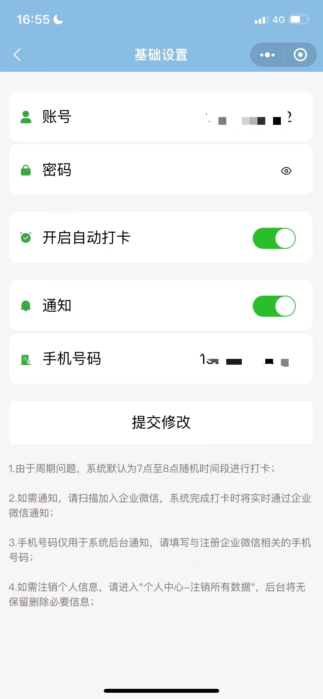
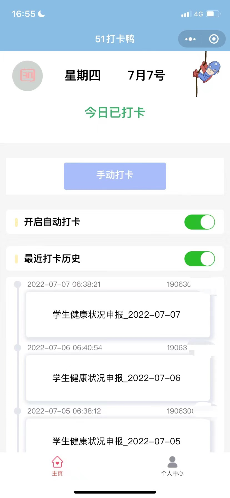
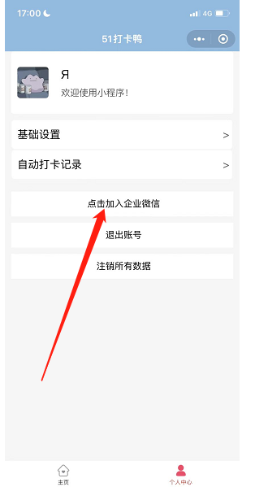
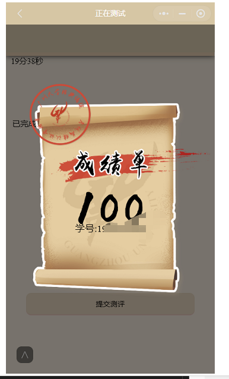

## 广州大学：
- 统一门户自动登录模块
- 健康系统自动打卡协议
- 经典诵读自动化完成一系列操作，如签到、每日一题、阅读、随机匹配、模拟考试、正式考试等
- 查询图书馆,测试登录图书馆状态，以便如预约位置，查询位置等
---

## 用户使用说明：

### 1、健康系统打卡
（1）、扫描二维码使用小程序,或者搜索小程序**51打卡鸭**


- - -
（2）、填写关键信息
<figure class="half">
    
</figure>

- - -

（3）、尝试是否能刷新打卡记录（下拉刷新，由于学校系统的不稳定性，若出现fail或出现返回空情况尝试多次刷新），或尝试手动打卡能成功则证明设置成功，则每天六点半到8点时间阶段会定时进行自动打卡！
<figure class="half">
    
</figure>

- - -

（4）、若要开启通知功能，在个人中心点击加入企业微信，则每次会通过企业微信通知！
<figure class="half">
    
</figure>
- - -

（5）、关于自动通知，以及如何切换企业微信

<figure class="half">
    
     
      
</figure>


- --
## 开发者使用：

**调用代码如下**
```
    user = ''
    pwd = ''

    # # 登录模块测试
    # res = loginTest(user, pwd)
    # print("登录结果",res)

    # # 健康系统的打卡历史获取
    # res = selectCardTest(user, pwd)
    # print("打卡历史", res)

    # 打卡
    # print("打卡",hitcardTest(user, pwd))

    # 查询图书馆,测试登录图书馆状态，以便如预约位置，查询位置等
    # print(selectRoomTest(user, pwd,'100589684'))

    # 经典诵读一系列操作，如签到、每日一题、阅读、随机匹配、模拟考试、正式考试等
    # n = DoJDSD('____________________key_________________________________')
    # print(n.getInfo())  # 获取个人信息
    # print(n.doSign())  # 签到
    # print(n.doRead())  # 阅读
    # for i in range(3): print(n.doTrain())  # 每日一练，每次3分，上限9分
    # for i in range(5):
    #     if (n.doGame()): break  # 随机匹配,提高成功率
    # print(n.doExam(type=0,time=2000))  # 考试（需要消耗2次考试机会）
```
**1、如何拿到经典诵读的key**
经过分析，发现页面有账号密码登录，但是这个过程需要利用微信的code，但是code获取通过微信生成，获取途径可以通过hook生成code，不过比较麻烦，你做了这个工具去拿code，当微信版本一更新，地址偏移之类，你的hook工具不兼容就会没用了。所以老老实实用抓包吧！

Windows用户利用fiddle就可以，如果抓不到，退出微信搜索wmpf这个文件夹删除即可，然后重新登录微信，路劲参考:
```
C:\Users\lenovo\AppData\Roaming\Tencent\WeChat\XPlugin\Plugins\WMPFRuntime
```
ios用户用stream抓包就行，在苹果商店可以下载，安卓用户可以利用小黄鸡app抓包！
- - -

**2、关于如何实现考试：**
```

说一下思路：
    讲道理，题目只返回了问题选项，没有把答案存储本地或者获取题目的在数据包里时候拿到，只有最后提交题目的时候才能拿到答案
    本质上，也就是说，只有交卷了才知道答案
    但是，有个离谱的地方，tmd居然可以交卷，而且交卷同一张卷子两次，那么第二次拿着第一次的答案，直接就是第一了
    具体操作：因为第一次提交返回的答案中只有答错的题目的答案，那么直接第一次提交的答案全部是Null值，此时就可保证提交后
    得到所有题目的答案，接着直接重复性提交即可
```
- - -
**3.如何截图用于第二课堂证明：**
（1）减小分数使上榜，截图榜单证明，就是有点费系统
（2）利用fiddle做一层中间人攻击即可，修改数据包,搜索下面数据包“###学号###”字符串，替换成你的学号即可
原始数据：
```
HTTP/1.1 200 OK
Date: Thu, 07 Jul 2022 08:39:36 GMT
Server: Apache/2.4.51 (Ubuntu)
Access-Control-Allow-Origin: *
Vary: Accept-Encoding
Keep-Alive: timeout=5, max=100
Connection: Keep-Alive
Content-Type: text/html; charset=UTF-8
Content-Length: 7218


{"status": 1, "form": "submit_test", "other": [{"question_id": "49b77e288a578619a823b33e4b6c6869", "answer_id": "B", "question_num": "5816", "index": 0}, {"question_id": "d0fa408af96a7e5ffa404128750bb60e", "answer_id": "C", "question_num": "3504", "index": 1}, {"question_id": "cd6017f3f33a8e6f7fcbcbe7a84c5863", "answer_id": "A", "question_num": "6396", "index": 2}, {"question_id": "d0b4e38422be7994864d62191ec757ee", "answer_id": "B", "question_num": "5490", "index": 3}, {"question_id": "bf9aa8941e8ccd55ded11367ffeed394", "answer_id": "A", "question_num": "3683", "index": 4}, {"question_id": "7eda3ffe8b95d969dae15d759e998ff0", "answer_id": "C", "question_num": "6188", "index": 5}, {"question_id": "557c300688692f1e063e0ef4bd45f6d9", "answer_id": "B", "question_num": "3792", "index": 6}, {"question_id": "85d56628012d29c6b2affb7ae535223a", "answer_id": "B", "question_num": "6230", "index": 7}, {"question_id": "092e2d1e489c51b627fa20df561e7c50", "answer_id": "C", "question_num": "5805", "index": 8}, {"question_id": "42cab9597a576ac350e866f2889c125b", "answer_id": "B", "question_num": "4167", "index": 9}, {"question_id": "e18e41b4db1ee69623d9dd3071fe0d5e", "answer_id": "C", "question_num": "4142", "index": 10}, {"question_id": "3db5b5b99ddac5438c36719f5a3207c8", "answer_id": "D", "question_num": "6989", "index": 11}, {"question_id": "5c2f94469a2bd4659f63e91aa68cde4d", "answer_id": "A", "question_num": "4840", "index": 12}, {"question_id": "890bf5ae667355793044ab3d5769a2f9", "answer_id": "B", "question_num": "7344", "index": 13}, {"question_id": "8a75ef5ce6614d38195cc3eefc2d58f6", "answer_id": "C", "question_num": "5972", "index": 14}, {"question_id": "dd7ff94493ff347f2e87383026e9476b", "answer_id": "B", "question_num": "2584", "index": 15}, {"question_id": "e0c69a725c9af13f24ef2524beaaf1cc", "answer_id": "B", "question_num": "5280", "index": 16}, {"question_id": "8b18f8ba55d6f20994fd79f1445f4173", "answer_id": "C", "question_num": "3819", "index": 17}, {"question_id": "801913d0789f92efa0ee90ba0ba46a2c", "answer_id": "B", "question_num": "5522", "index": 18}, {"question_id": "eb4a663351902bb86422d2eba85088d1", "answer_id": "C", "question_num": "3049", "index": 19}, {"question_id": "73321d41b374928a5e10283e318f3171", "answer_id": "\u60a0\u7136\u89c1\u5357\u5c71", "question_num": "5943", "index": 20}, {"question_id": "56341f7f65321ee465601446394f954d", "answer_id": "\u7c92\u7c92\u7686\u8f9b\u82e6", "question_num": "6536", "index": 21}, {"question_id": "71c0182587997aa97a66e46043ced8cc", "answer_id": "\u56fd\u7834\u5c71\u6cb3\u5728", "question_num": "5116", "index": 22}, {"question_id": "3adee68683551f58adcfa4ce26ca5080", "answer_id": "\u4e00\u7247\u51b0\u5fc3\u5728\u7389\u58f6", "question_num": "386", "index": 23}, {"question_id": "f0d930c94046276f04b76a64f7c5bbfd", "answer_id": "\u7559\u53d6\u4e39\u5fc3\u7167\u6c57\u9752", "question_num": "3749", "index": 24}, {"question_id": "89c220cadf90b7b64ca36330bd2c455a", "answer_id": "\u8c01\u77e5\u76d8\u4e2d\u9910", "question_num": "3096", "index": 25}, {"question_id": "cdf8ddc9e47573b6bfa870d403a3c182", "answer_id": "\u57ce\u9619\u8f85\u4e09\u79e6", "question_num": "2711", "index": 26}, {"question_id": "7b2294f6e38ebb8e5de85540fc263180", "answer_id": "\u971c\u53f6\u7ea2\u4e8e\u4e8c\u6708\u82b1", "question_num": "4910", "index": 27}, {"question_id": "8965839ad69de43a6432a99b4b017f2b", "answer_id": "\u5c0f\u65f6\u4e0d\u8bc6\u6708", "question_num": "3099", "index": 28}, {"question_id": "f2f3b03ca708b533ee7ad9a64dd7ddea", "answer_id": "\u6625\u8695\u5230\u6b7b\u4e1d\u65b9\u5c3d", "question_num": "3651", "index": 29}, {"question_id": "d8e926d40c2f33cfc4f7d25119727dc5", "answer_id": "\u767d\u5154", "question_num": "5599", "index": 30}, {"question_id": "be0fddf86c1672297b1b588dd3c4f20c", "answer_id": "\u52ff\u65bd\u4e8e\u4eba", "question_num": "4557", "index": 31}, {"question_id": "521500a7c0fd4e94dd6128094be8e852", "answer_id": "\u8c01\u8a00\u5bf8\u8349\u5fc3", "question_num": "4472", "index": 32}, {"question_id": "8514a704bd2cb034de024912a08ce333", "answer_id": "\u62a5\u7b54\u5e73\u751f\u672a\u5c55\u7709", "question_num": "198", "index": 33}, {"question_id": "547a040c8361b898d3ca467ae1b0db8b", "answer_id": "\u5143\u5bb5\u8282", "question_num": "7338", "index": 34}, {"question_id": "6de375b8b235df2af50585babb0ccf33", "answer_id": "\u7ae5\u7a1a", "question_num": "5601", "index": 35}, {"question_id": "7fa30d6d64a9472dcb825cea74d87e13", "answer_id": "\u6e05\u660e\u65f6\u8282\u96e8\u7eb7\u7eb7", "question_num": "4456", "index": 36}, {"question_id": "6a102e176838adb26d41dd783b57f66c", "answer_id": "\u4f46\u613f\u4eba\u957f\u4e45", "question_num": "4498", "index": 37}, {"question_id": "a7ae95e1ec0fb9c5c4cb966cd7d07ad9", "answer_id": "\u5343\u91cc\u5171\u5a75\u5a1f", "question_num": "4473", "index": 38}, {"question_id": "8d38e5ee395db22f9c02fe90549b59a9", "answer_id": "\u6bcf\u9022\u4f73\u8282\u500d\u601d\u4eb2", "question_num": "4500", "index": 39}, {"question_id": "20dcfb3d300a845ce92ed7d189f2e5aa", "answer_id": "\u738b\u52c3", "question_num": "5141", "index": 40}, {"question_id": "893872e691b44a1c67217805d6c60ccb", "answer_id": "\u674e\u6e05\u7167", "question_num": "3609", "index": 41}, {"question_id": "2b1cc04765a7cee377cd42377b18531e", "answer_id": "\u738b\u7ef4", "question_num": "219", "index": 42}, {"question_id": "648357ddb9071d7f98aec2092e7581c9", "answer_id": "\u82cf\u8f7c", "question_num": "2665", "index": 43}, {"question_id": "864cfe7f8dc1ff5b9a1ae548f5fb232c", "answer_id": "\u90e6\u9053\u5143", "question_num": "4802", "index": 44}, {"question_id": "0eb1527a4e3b9d59922d9416066bdf4e", "answer_id": "\u7c89\u9aa8\u788e\u8eab\u6d51\u4e0d\u6015\uff0c\u8981\u7559\u6e05\u767d\u5728\u4eba\u95f4", "question_num": "4866", "index": 45}, {"question_id": "a155e8beb8df90b497686cd44ef35b45", "answer_id": "\u674e\u6e05\u7167", "question_num": "2890", "index": 46}, {"question_id": "c9a209b2bdc9e2bddf3a9b4fb9aa2f43", "answer_id": "\u90d1\u677f\u6865", "question_num": "3309", "index": 47}, {"question_id": "45ae30ee69418d1e65c93bb791bb87ce", "answer_id": "\u8f9b\u5f03\u75be", "question_num": "5157", "index": 48}, {"question_id": "c7d8cc594e9044dc0e10022452775a5f", "answer_id": "\u4e0d\u8bc6\u5e90\u5c71\u771f\u9762\u76ee\uff0c\u53ea\u7f18\u8eab\u5728\u6b64\u5c71\u4e2d", "question_num": "3173", "index": 49}, {"question_id": "98623ad36e89ce6deb50d9b24ea9e555", "answer_id": "\u660e\u6708\u6765\u76f8\u7167", "question_num": "2823", "index": 50}, {"question_id": "fc2e5795cf40483082aca7129394e317", "answer_id": "\u4e00\u5f26\u4e00\u67f1\u601d\u534e\u5e74", "question_num": "2715", "index": 51}, {"question_id": "6534f99dbee0b6680cd4b319f161a626", "answer_id": "\u51fa\u95e8\u6414\u9996\u6006\u5e73\u751f", "question_num": "3359", "index": 52}, {"question_id": "43bd66e4eec84860945acb036492f8a4", "answer_id": "\u501f\u95ee\u9152\u5bb6\u4f55\u5904\u6709", "question_num": "3081", "index": 53}, {"question_id": "cd56439f12fb8893b3c83634ef921abc", "answer_id": "\u5929\u6c14\u665a\u6765\u79cb", "question_num": "285", "index": 54}, {"question_id": "89ded891dc8e254397d835c272804ee9", "answer_id": "\u4e0d\u754f\u6d6e\u4e91\u906e\u671b\u773c", "question_num": "336", "index": 55}, {"question_id": "d53fc79b965fee34b0474c5f09809061", "answer_id": "\u660e\u6708\u6765\u76f8\u7167", "question_num": "5170", "index": 56}, {"question_id": "eb0b0f77ff2073a35e4f75e729cd25cf", "answer_id": "\u4e00\u66f2\u65b0\u8bcd\u9152\u4e00\u676f", "question_num": "669", "index": 57}, {"question_id": "b308db3b905ad19026916ee4df0a1d5a", "answer_id": "\u70fd\u706b\u8fde\u4e09\u6708", "question_num": "615", "index": 58}, {"question_id": "283e326cd92267e0c710e6aa6f8fb181", "answer_id": "\u6bcf\u9022\u4f73\u8282\u500d\u601d\u4eb2", "question_num": "3816", "index": 59}], "score": 100, "answer": [], "right": 100, "xh": "###学号####", "debug_log": ["20181025", "1"]}


```

**效果展示：**



----

